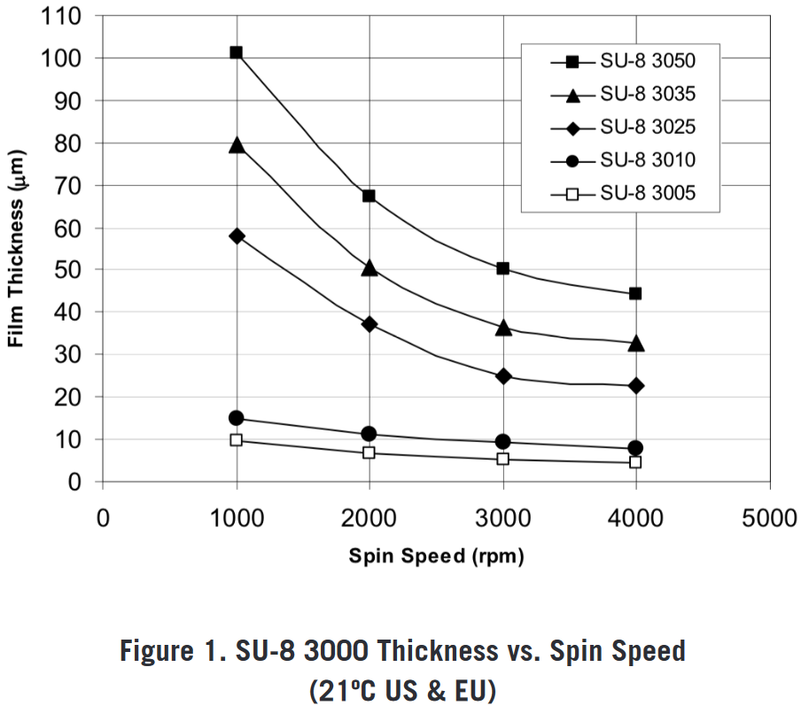
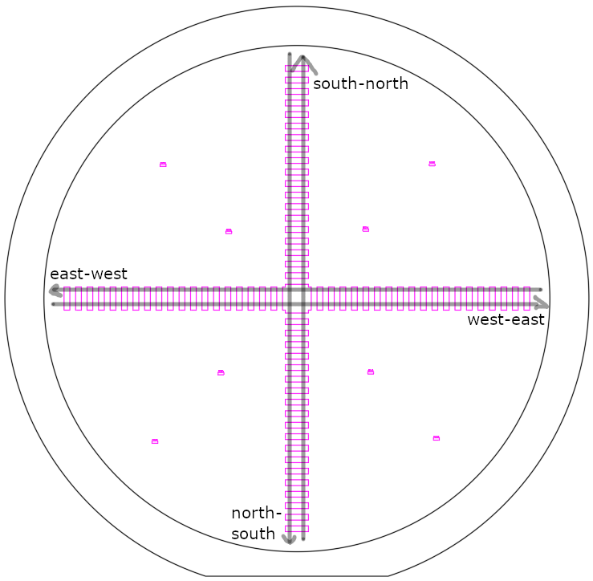
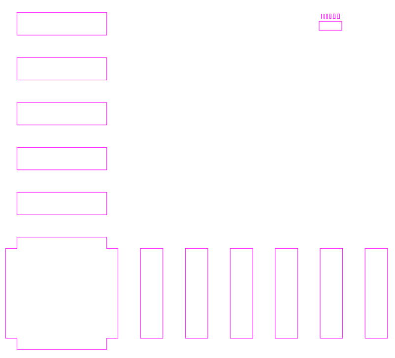

```{r, include = FALSE}
knitr::opts_chunk$set(
  collapse = TRUE,
  comment = "#>"
)
```


For my microfluidic chips, channel heights in the range of 20-30 µm are desired.
To obtain these heights during the photolithography process, a photoresist with suitable viscosity is required.
{ width=50% }

These are the spin curves for the SU-8 3000 series [@noauthor_su-8_nodate].
It seems like SU-8 3035 can yield thicknesses in the desired range (extrapolating for higher RPMs, and from the experience that at 6000 RPM 30 µm thickness can be achieved with SU-8 3050).
Therefore, 115.2 g SU-8 3050 was mixed with 1.42 g of thinner solution, in order to obtain a custom dilution that mimics the behaviour of SU-8 3035.
In the following, SU-8 3035 refers to this custom dilution.

After preparation of SU-8 3035, a spin curve analysis was conducted to characterize the relation between spin speed and film thickness of the custom photoresist.
To that end, a cross pattern (see image) was exposed on cleaned and re-used silicon wafers, after spin-coating SU-8 3035 at 3000, 4000, and 5000 RPM, respectively.
For each of these RPM, three chips were prepared: two chips using a spin duration of 30s (to have duplicate measurements), and one chip using a spin duration of 60 s.
Therefore, in total, nine wafers were prepared.

{ width=50% }
{ width=50% }

After photolithography, the resulting height profiles were measured using a Dektak profilometer.
Unfortunately, when measuring over long distances with this machine, measurements are drifting away from the reference level quite significantly, which necessitates a correction before data evalutation.
Therefore, the cross structure exposed on the wafer includes repeated gaps in order to pick up the zero-level along the entire wafer.

For each wafer, four traces were measured: top-to-bottom, left-to-right, bottom-to-top, and right-to-left (see figure).
This results in duplicate measurements for all the structures.

In this vignette, the post-processing and drift correction of the Dektak data will be carried out.
This includes:

- reading in CSV files,
- recognition of the reference level segments,
- drift correction,
- averaging of duplicate measurements,
- interpolation of height profiles between the gaps in the structure.


```{r setup}
library(masterthesis)
```


## References

